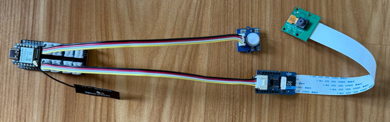
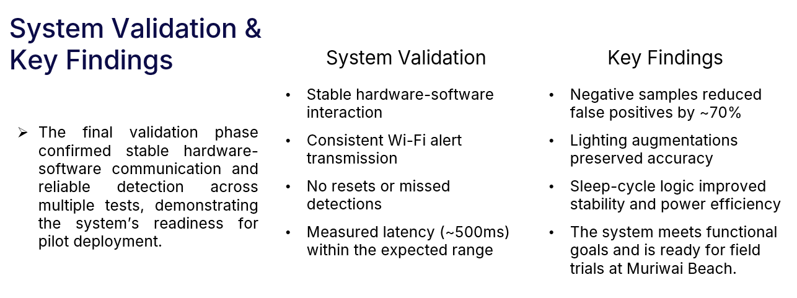

# TinyML Kororā Dog Detection System

An edge AI system designed to detect dogs near **Kororā (Little Blue Penguin) nesting areas** using TinyML and embedded computer vision.

This project demonstrates how **low-power edge AI systems can support wildlife conservation** by enabling automated monitoring in remote coastal environments.

# Overview

Kororā penguins are vulnerable to dog attacks near coastal nesting areas.

Monitoring these locations manually is difficult because:

- locations are remote
- continuous monitoring is required
- human observation is limited

This project explores how **TinyML and embedded AI systems can automatically detect threats and trigger alerts**.

# System Architecture

Detection pipeline:

1. PIR motion sensor detects movement.
2. ESP32-S3 microcontroller activates the system.
3. Grove Vision AI V2 processes captured frames.
4. Embedded object detection model identifies dogs.
5. Detection triggers an alert notification.

This pipeline allows **real-time monitoring with low power consumption**.

# Hardware Components

Main hardware components used:

- ESP32-S3 microcontroller
- Grove Vision AI V2 camera module
- PIR motion sensor
- power management module
- wireless alert system

These components enable the system to perform **AI inference directly on-device**.

# Model Development

The AI model was designed for **TinyML deployment**.

Key considerations:

- lightweight model architecture
- low memory usage
- fast inference time
- real-time detection capability

Tools used in development:

- Roboflow for dataset preparation
- Edge Impulse for TinyML model training
- SenseCraft AI for configuration
- Arduino IDE for firmware integration

# Evaluation

Testing showed that the system can successfully detect dogs within the monitored area.

Observations:

- reliable motion-triggered activation
- stable hardware-software integration
- successful detection across test scenarios
- real-time alert capability

The results indicate the system is suitable for **wildlife monitoring applications**.

# Key Features

- motion-triggered detection pipeline
- TinyML edge inference
- low power operation
- automated alert system
- wildlife protection application

# Project Context

This project was developed as part of the **Master of Artificial Intelligence program at the University of Auckland**.

The goal was to explore how **AI and embedded systems can assist wildlife conservation efforts**.

# Author

Vennela Mangala Venkatesha  
Master of Artificial Intelligence  
University of Auckland
