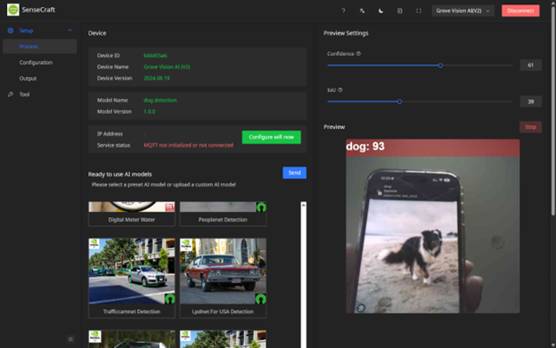
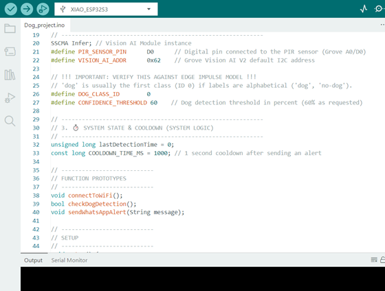

# TinyML Dog Detection System To Save Kororā

An edge AI system designed to detect dogs near **Kororā (Little Blue Penguin) nesting areas** using TinyML and embedded computer vision.

This project demonstrates how **low-power edge AI systems can support wildlife conservation** by enabling automated monitoring in remote coastal environments.

# Problem

Kororā penguins are vulnerable to dog attacks near coastal nesting areas.

Monitoring these areas manually is difficult because:

- nesting locations are remote
- monitoring must be continuous
- human observation is limited

An automated detection system can help identify threats quickly.

# Proposed Solution

This project implements a **TinyML-based embedded vision system** capable of detecting dogs in real time.

Key design goals:

- edge AI inference
- low power consumption
- real-time detection
- autonomous monitoring

# System Architecture

Detection pipeline:

1. PIR motion sensor detects movement.
2. ESP32-S3 activates the system.
3. Grove Vision AI V2 captures frames.
4. Embedded AI model detects dogs.
5. Detection triggers an alert notification.

# Hardware Setup

Main hardware components:

- ESP32-S3 microcontroller
- Grove Vision AI V2 camera module
- PIR motion sensor
- power management module
- wireless communication module

The system performs **AI inference directly on-device**.

# Dataset Preparation

Training data included:

- dog images from public datasets
- environmental negative samples
- bounding box annotations for detection

Dataset preprocessing included:

- image resizing
- data augmentation
- dataset balancing
- train / validation splitting

# Model Development

Initial model:

**Dog vs Non-Dog classification model**

Training configuration:

- 70 epochs
- learning rate = 0.001
- batch size = 128

Performance:

- validation accuracy ≈ **83.5%**
- F1 score ≈ **0.83**

# Deployment Constraint

On-device testing revealed a latency issue:

- inference time ≈ **356 ms**

This was too slow for real-time monitoring.

# Final Model

The system was redesigned using a **FOMO object detection model** optimized for TinyML.

Final model configuration:

- MobileNetV2-0.1
- int8 quantization
- trained using Edge Impulse

Final inference time:

**≈ 6 ms**

# Tools Used

Development tools:

- Roboflow — dataset preparation
  
- Edge Impulse — TinyML training
  
- SenseCraft AI — model configuration
  
- Arduino IDE — firmware deployment
  

# Evaluation

System testing showed:

- reliable motion-trigger activation
- stable hardware–software integration
- successful detection during simulation tests
- alert notifications triggered correctly

Detection was reliable within approximately **5 meters**.

# Results

| Model | Accuracy | Inference Time |
||||
| Classification Model | ~83.5% | ~356 ms |
| FOMO Detection Model | ~0.56-0.58 F1 | ~6 ms |

Key insight:

Real-time embedded systems require **balancing accuracy with inference speed**.

# Key Features

- motion-triggered detection pipeline
- TinyML edge inference
- low power operation
- real-time alerts
- wildlife monitoring application

# Future Work

Possible improvements include:

- expanding training datasets
- improving low-light detection
- extended field deployment
- improved wireless monitoring

# Author

**Vennela Mangala Venkatesha**  
Master of Artificial Intelligence  
University of Auckland
